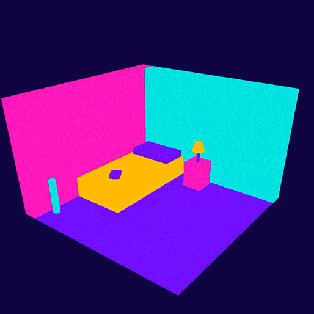

# Wind Down Bedtime App



*Evolution of Three.js 3D model*


wind down is a prototype for bedtime app that allows users to create a bedtime routine with the goal of improving sleep habits. The app is centered around an interactive room built in Three.js that contains objects related to the routine’s activities set by the user.

**To run this app locally:**

- Fork and clone the repo
- Run ```npm install``` in the terminal after opening the repo in VS Code or your editor of choice
- Create a file called .shhh.js (this is already in the gitignore file)
- Include the text ```process.env.JWT = "yourSecretCodeHere"``` in the .shhh.js file
- Create a postgres database called ```wind-down```
- Run ```npm run seed``` in the terminal to seed the database

